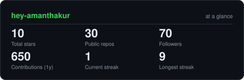
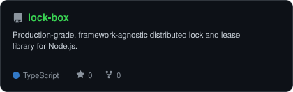
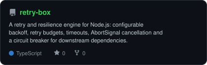
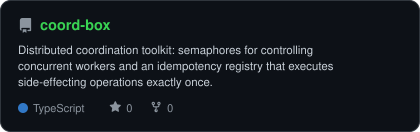
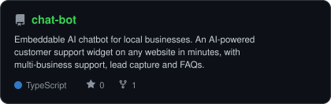

<div align="center">

<!-- PORTRAIT - generated by scripts/dotify.py from assets/me.png (GitHub avatar).
     Colour mode, so one file serves both GitHub themes. Regenerate with:
       python scripts/dotify.py assets/me.png -o assets/portrait \
         --cols 100 --equalize --detail 0.5 --color --reveal -->


<br>

<!-- NAME / TAGLINE - animated typing -->
<a href="https://github.com/hey-amanthakur">
  
</a>

<br>

<!-- SOCIALS -->
<a href="https://www.linkedin.com/in/aman--thakur/"></a>
<a href="https://x.com/hey_amanthakur"></a>
<a href="mailto:thakuraman22july@gmail.com"></a>
<a href="https://playful-biscochitos-d342ae.netlify.app/"></a>
<a href="https://codeforces.com/profile/RukahtNama"></a>


</div>

---

## `~/` whoami

```console
$ cat about.txt
```

Hi, I'm **Aman Thakur**. I build full-stack products and the systems plumbing
underneath them — locks, retries, rate limiters — and I've been going deep on
applied LLM systems lately.

- Currently building **[lock-box](https://github.com/hey-amanthakur/lock-box)**, **[retry-box](https://github.com/hey-amanthakur/retry-box)** and **[coord-box](https://github.com/hey-amanthakur/coord-box)** — a distributed-systems toolkit for Node.js
- Portfolio: **[playful-biscochitos-d342ae.netlify.app](https://playful-biscochitos-d342ae.netlify.app/)**
- Focus 2026: **applied LLM systems & dev tooling** · learning distributed systems & agent orchestration
- Open to **open-source & freelance** · reply time ~24h
- Fun fact: **"Code is the closest thing we have to magic — so build responsibly."**

<br>

<div align="center">

## `~/` toolbox


</div>

---

<div align="center">

## `~/` skill radar

<table>
<tr>
<td width="50%" align="center" valign="middle">

<!-- Self-rated radar - edit assets/skills.json, the workflow redraws it -->
<picture>
  <source media="(prefers-color-scheme: dark)"  srcset="assets/radar-dark.svg">
  <source media="(prefers-color-scheme: light)" srcset="assets/radar-light.svg">
  
</picture>

</td>
<td width="50%" align="center" valign="middle">

<!-- Live radar built from real language byte counts across your repos -->
<picture>
  <source media="(prefers-color-scheme: dark)"  srcset="assets/radar-langs-dark.svg">
  <source media="(prefers-color-scheme: light)" srcset="assets/radar-langs-light.svg">
  
</picture>

</td>
</tr>
</table>

</div>

---

<div align="center">

## `~/` contribution calendar

<!-- 3D isometric calendar, regenerated every 6h by .github/workflows/metrics.yml -->


<br><br>

<!-- Snake eats the contribution graph - .github/workflows/snake.yml -->
<picture>
  <source media="(prefers-color-scheme: dark)"  srcset="https://raw.githubusercontent.com/hey-amanthakur/hey-amanthakur/output/snake-dark.svg">
  <source media="(prefers-color-scheme: light)" srcset="https://raw.githubusercontent.com/hey-amanthakur/hey-amanthakur/output/snake.svg">
  
</picture>

</div>

---

<div align="center">

## `~/` the numbers

<!-- Generated by scripts/cards.py into this repo. Deliberately NOT
     github-readme-stats / streak-stats / github-profile-trophy: those are
     shared public instances that go down and take the whole section with them. -->
<picture>
  <source media="(prefers-color-scheme: dark)"  srcset="assets/card-stats-dark.svg">
  <source media="(prefers-color-scheme: light)" srcset="assets/card-stats-light.svg">
  
</picture>

<br>


<br><br>


</div>

---

<div align="center">

## `~/` selected work

<!-- Cards generated by scripts/cards.py from assets/projects.json.
     Stars, forks and language are pulled live from the API on every run. -->
<table>
<tr>
<td width="50%">
  <a href="https://github.com/hey-amanthakur/lock-box">
    <picture>
      <source media="(prefers-color-scheme: dark)"  srcset="assets/card-lock-box-dark.svg">
      <source media="(prefers-color-scheme: light)" srcset="assets/card-lock-box-light.svg">
      
    </picture>
  </a>
</td>
<td width="50%">
  <a href="https://github.com/hey-amanthakur/retry-box">
    <picture>
      <source media="(prefers-color-scheme: dark)"  srcset="assets/card-retry-box-dark.svg">
      <source media="(prefers-color-scheme: light)" srcset="assets/card-retry-box-light.svg">
      
    </picture>
  </a>
</td>
</tr>
<tr>
<td width="50%">
  <a href="https://github.com/hey-amanthakur/coord-box">
    <picture>
      <source media="(prefers-color-scheme: dark)"  srcset="assets/card-coord-box-dark.svg">
      <source media="(prefers-color-scheme: light)" srcset="assets/card-coord-box-light.svg">
      
    </picture>
  </a>
</td>
<td width="50%">
  <a href="https://github.com/hey-amanthakur/chat-bot">
    <picture>
      <source media="(prefers-color-scheme: dark)"  srcset="assets/card-chat-bot-dark.svg">
      <source media="(prefers-color-scheme: light)" srcset="assets/card-chat-bot-light.svg">
      
    </picture>
  </a>
</td>
</tr>
</table>

<sub>

| project | stack |
|---|---|
| **[lock-box](https://github.com/hey-amanthakur/lock-box)** | `TypeScript` `Node.js` |
| **[retry-box](https://github.com/hey-amanthakur/retry-box)** | `TypeScript` `Node.js` |
| **[coord-box](https://github.com/hey-amanthakur/coord-box)** | `TypeScript` `Node.js` |
| **[chat-bot](https://github.com/hey-amanthakur/chat-bot)** | `TypeScript` `OpenRouter` |

</sub>

</div>

---

## `~/` developer timeline

```text
2019 ─● Wrote first "Hello, World" — hooked immediately
2020 ─● First public repository
2021 ─● First accepted open-source PR
2022 ─● Shipped first production system at scale
2023 ─● Started mentoring / writing technical posts
2024 ─● Led a cross-functional engineering initiative
2025 ─● Went deep on applied LLM systems
2026 ─● Current: building agentic developer tooling
      ○ Next: [your goal here]
```

---

<div align="center">

## `~/` competitive circuit

<a href="https://codeforces.com/profile/RukahtNama"></a>
<a href="https://www.codechef.com/users/hey-amanthakur"></a>
<a href="https://www.hackerrank.com/profile/Rukaht_Nama"></a>
<a href="https://stackoverflow.com/users/12460954/aman-thakur"></a>

</div>

> Static link badges only — none of these platforms offer a free, reliable live
> badge API. Check my [GitHub profile](https://github.com/hey-amanthakur) for
> the latest contribution activity.

---

<div align="center">

## `~/` support

<a href="https://github.com/sponsors/hey-amanthakur"></a>
<a href="https://razorpay.me/@amanthakur7343"></a>

</div>

---

<div align="center">

<sub>`01110100 01101000 01100001 01101110 01101011 01110011 00100000 01100110 01101111 01110010 00100000 01110011 01100011 01110010 01101111 01101100 01101100 01101001 01101110 01100111`</sub>

</div>
